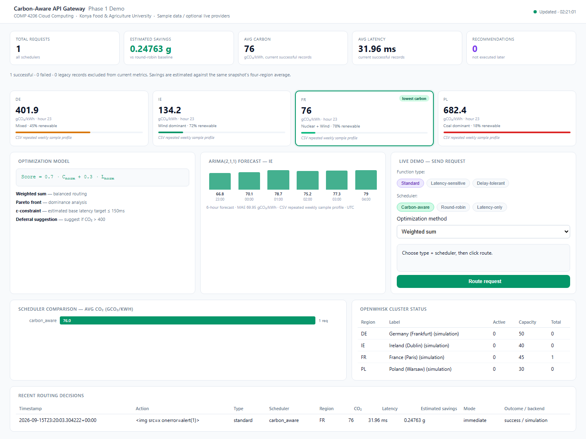

# Carbon-Aware Gateway

[](https://github.com/ykart897/carbon-aware-gateway/actions/workflows/ci.yml)


A carbon-aware serverless request router with regional intensity forecasting,
reproducible scheduler experiments, and explicit sustainability metrics.

A Python 3.12 portfolio and research demo that routes work between four **modeled**
regions (DE, IE, FR, PL), comparing carbon intensity and estimated base latency.
The default runs without API keys or Docker: repeating CSV sample profiles,
simulated invocations, a FastAPI service, and a browser dashboard.

## Highlights

- Routes requests with carbon-aware, round-robin, weighted-sum, Pareto, or
  epsilon-constrained strategies.
- Keeps carbon, latency, backend, data-source, SLA, and failure metadata in a
  versioned SQLite decision log.
- Produces deterministic ARIMA forecasts with optional Prophet support and clear
  fallback metadata.
- Runs paired, seeded scheduler experiments and generates JSON, HTML, and PNG
  artifacts from the same results.
- Ships with Windows/Linux instructions, Docker-based Linux verification, GitHub
  Actions CI, and desktop/mobile browser acceptance evidence.

## Architecture

```text
Browser / HTTP client
        |
FastAPI gateway -> scheduler -> weighted sum / Pareto / epsilon optimizer
        |              |                         |
        |         immediate invocation      one carbon snapshot
        |         simulation or OpenWhisk   CSV / optional live providers
        |
SQLite versioned request metrics

CSV history -> ARIMA / optional Prophet -> suggestion only (no job queue)
Experiments -> same scheduler + simulation model -> JSON / HTML / PNG
```

The optional OpenWhisk deployment is **one local instance with four actions**.
It does not deploy infrastructure into four geographic regions.

## Quick start — Windows PowerShell

Install Python 3.12, then run from the project directory:

```powershell
py -3.12 -m venv .venv
.\.venv\Scripts\python.exe -m pip install -r requirements.txt
.\.venv\Scripts\python.exe main.py
```

## Quick start — Linux

```sh
python3.12 -m venv .venv
.venv/bin/python -m pip install -r requirements.txt
.venv/bin/python main.py
```

Open [the dashboard](http://127.0.0.1:8000/dashboard) or
[interactive API documentation](http://127.0.0.1:8000/docs).
The server listens on `127.0.0.1:8000` by default. Stop it with Ctrl+C.

### Dashboard preview



The same dashboard was checked at a 390px mobile viewport; the layout had no
horizontal overflow and the controls exposed pressed state through ARIA.
The generated report also renders as [an HTML artifact](experiments/output/phase2_report.html).

Example request (use `curl.exe` on Windows):

```sh
curl http://127.0.0.1:8000/route -H 'Content-Type: application/json' \
  -d '{"action":"image_resize","scheduler":"carbon_aware","function_type":"delay_tolerant","opt_method":"epsilon","data":{"width":128}}'
```

For PowerShell without shell quoting differences:

```powershell
$body = @{ action='image_resize'; scheduler='carbon_aware'; data=@{width=128} } | ConvertTo-Json
Invoke-RestMethod http://127.0.0.1:8000/route -Method Post -ContentType application/json -Body $body
```

## Configuration and metric meaning

Optionally copy `.env.example` to `.env`. Real environment variables take priority.

| Setting | Default / purpose |
|---|---|
| `HOST`, `PORT` | `127.0.0.1`, `8000` |
| `DATABASE_PATH` | `routing.db` in the project directory |
| `ENERGY_KWH_PER_REQUEST` | `0.001`; a positive **assumption**, not measured energy |
| `USE_LIVE_API` | `false`; ElectricityMaps also needs its API key |
| `ENTSOE_API_KEY` | Empty; enables optional ENTSO-E retrieval when supplied |
| `OPENWHISK_REAL` | `false`; actual invocation requires host and credentials |

Estimated savings in grams = `(four-region mean intensity - selected intensity)
* assumed kWh`. All terms use the same snapshot. Negative savings remain visible.
Failed requests have no savings; legacy rows stay in the database but are excluded
from current metric totals (`metric_version=2`). Counts still disclose failures and
legacy requests. Database errors are not silently suppressed.

Delay-tolerant work **runs immediately exactly once**. If selected carbon exceeds
400 gCO2/kWh, `deferral_recommendation` may describe a lower-carbon future UTC
window. Nothing is queued and the recommendation does not contribute to savings.
The epsilon method's SLA concerns estimated **base** latency, not total execution
time. If no region meets it, the fastest region is chosen and `sla_satisfied=false`.

The CSV files have no verified provenance and are sample profiles, not current
measurements. ENTSO-E data produces a generation-mix estimate from emission factors;
it is not consumption-based accounting and does not include imports. Provider
errors are labeled as fallback data. Real OpenWhisk failures remain failures.

## Experiments and optional forecasting

```sh
python -m pip install -r requirements-experiments.txt
python experiments/run_experiments.py --seed 42 --samples 50 --output-dir experiments/output
python experiments/generate_report.py --input experiments/output/experiment_results.json --output-dir experiments/output
python experiments/generate_plots.py --input experiments/output/experiment_results.json --output-dir experiments/output/figures
```

Replace `python` with your virtual environment interpreter. For real Prophet:

```sh
python -m pip install -r requirements-prophet.txt
```

Without Prophet the API explicitly reports `model_used=exponential_smoothing`.
Forecast times derive from the last observation in UTC. Point forecasts do not
include calibrated uncertainty intervals. ARIMA is a lightweight implementation
with a heuristic stationarity check, not a substitute for a validated statistical
forecasting system.

See [experiment methodology](experiments/README.md), the
[generated report](experiments/output/phase2_report.html), and the
[academic draft](paper/draft.md). Historical outputs are excluded from publication.
Hourly sample profiles are correlated; reported paired p-values are exploratory,
unadjusted simulation comparisons, not proof of real-world emissions reductions.

## Optional OpenWhisk

Install Docker and `wsk` yourself. Supply your namespace credentials through
`OPENWHISK_AUTH`, then run `bash openwhisk/deploy.sh` from a Bash environment.
The script reuses a running container, refuses a stopped existing container, waits
for readiness, and uses the shared `carbon_worker.py`. It never deletes a container
or changes global CLI properties. Pin `OW_IMAGE` to an image you have validated
when reproducing a particular deployment. Set `OPENWHISK_REAL=true` only after
deployment succeeds. Worker outputs simulate work even when invocation is real.

## Tests and checks

```sh
python -m unittest discover -s tests -v
python tests/smoke_server.py
python -m pip install -r requirements-dev.txt
python -m ruff check .
```

Core-only installs skip experiment tests. Full checks require the experiment
dependencies. Tests and the HTTP smoke use temporary databases and no live API
keys. Browser/mobile acceptance is tracked in
[the implementation plan](IYILESTIRME_PLANI.md); do not infer completed checks from
the presence of a workflow file.

`requirements-core.lock` pins transitive dependencies from the verified clean
Windows Python 3.12 environment. Install it instead of `requirements.txt` to
reproduce that core package set. `requirements-full.lock` pins the separately
verified full environment, including experiments, Prophet and Ruff. Both lock
files were also installed and checked in a clean Python 3.12 Linux container.
To repeat the Linux checks with Docker installed, run
`docker compose -f compose.verify.yml run --rm verify`. This mounts the project
read-only and executes tests in a disposable copy. Hosted GitHub Actions have not
been run; the local Windows/Linux checks exercise their commands.

## Scope and attribution

This is a local research demo, not an authenticated production service, durable
queue, measured energy monitor or geographically distributed deployment.

Contributors: Rumeysa KAHVECİ, Yusuf KART, Furkan CİHAN, Mehmet Ali YETİK.
No license has been selected by the coauthors. This repository does not claim
permission for reuse pending their license decision.
