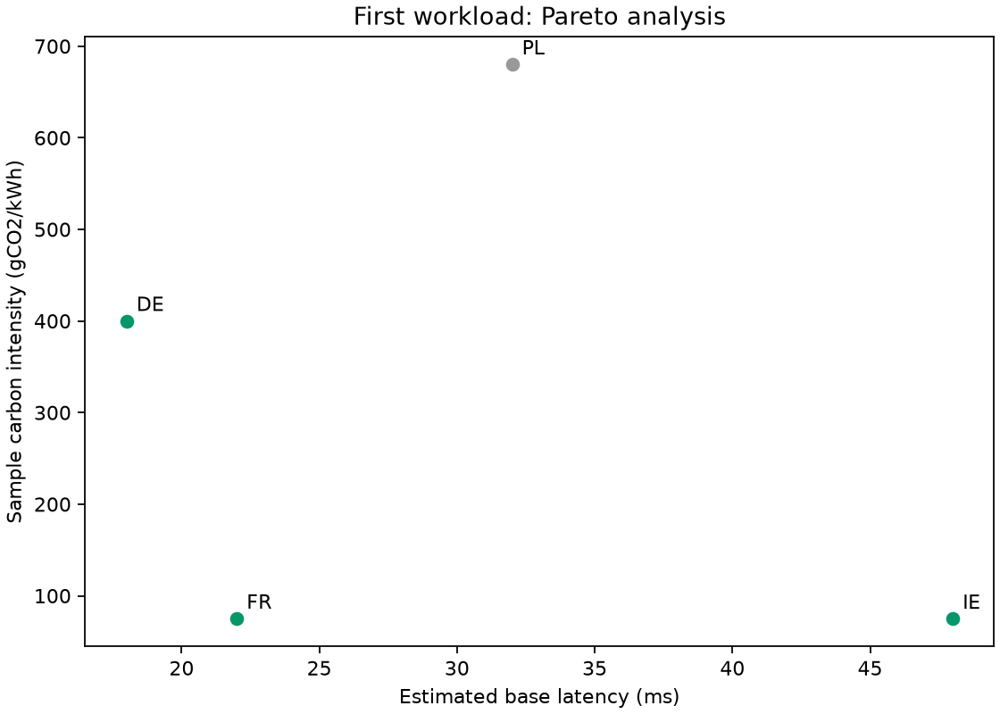
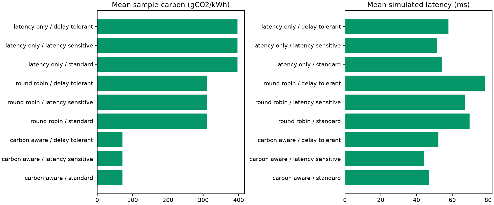
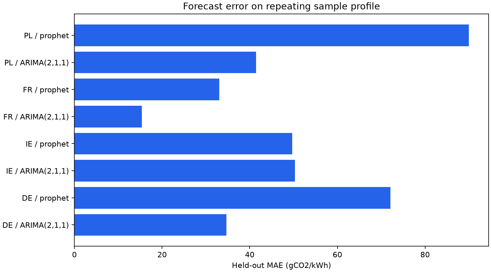

# Energy-Aware Serverless Function Placement with Carbon-Intensity Forecasting

**Rumeysa KAHVECݹ, Yusuf KART¹, Furkan CİHAN¹, Mehmet Ali YETİK¹**
¹Department of Computer Engineering, Konya Food and Agriculture University, Konya, Turkey

## Abstract

This project is a reproducible local research demo of carbon-aware function
placement. A FastAPI gateway compares four modeled regions using weighted-sum,
Pareto-front and epsilon-constraint methods. It supports immediate simulated
invocations and an optional single-host Apache OpenWhisk backend. Delay-tolerant
work may receive a future UTC execution recommendation, but no queue or temporal
execution is implemented. Estimated emissions use an explicit energy assumption
and the same carbon snapshot as the placement decision.

The current evaluation uses repeating CSV sample profiles of unverified provenance,
not measured grid histories. Fifty paired workloads for each of three function
types and three schedulers produce 450 simulated invocations. The results below
are descriptive simulation results; they do not establish measured emissions
reductions or compare fairly with unrelated published deployments.

## 1. Architecture and contribution

The application is a modular Python service, not a microservice deployment.
A carbon provider supplies a snapshot, an optimizer chooses a modeled region,
and the scheduler invokes that region immediately. SQLite records the decision,
execution outcome, data source, backend, energy assumption and metric version.
The dashboard displays these computed values without recomputing savings.

The optional deployment creates four actions on **one local OpenWhisk instance**.
Action names represent DE, IE, FR and PL; this does not establish geographic
placement or measure cross-region network latency. Real OpenWhisk invocation
preserves the total call duration and failures, while the action itself performs
synthetic work. The default Python simulation requires neither Docker nor keys.

The contribution is an inspectable demonstration of consistent routing,
estimated metrics, explicit recommendation semantics, and repeatable experiments.
It does not claim new scheduling algorithms or superiority to other systems.

## 2. Placement and metrics

Weighted sum uses 0.7 normalized carbon intensity plus 0.3 normalized estimated
base latency. Equal ranges normalize to zero. Pareto analysis identifies solutions
not dominated on both dimensions and selects a weighted-sum solution from that
front. Epsilon optimization minimizes carbon among regions meeting the configured
base latency target (150 ms by default). If none qualify, it chooses the fastest
region and reports that the target is not satisfied. Cold starts and execution
time mean this target is not a guarantee about total response latency.

For one successful request:

```text
baseline intensity = arithmetic mean of the four snapshot intensities
estimated savings (g) = (baseline intensity - selected intensity) * assumed energy (kWh)
```

The default assumed energy is 0.001 kWh. Negative estimates are retained. Failed
invocations have no savings. Metric version 2 separates current totals from
historical rows, which remain preserved. These quantities are neither meter
readings nor a complete operational carbon inventory.

For delay-tolerant work above 400 gCO2/kWh, a forecast can produce a lower-carbon
future recommendation. The selected current region still runs the work immediately
once. Suggested future benefits are recorded separately as unrealized estimates.
There is no invented waiting-time penalty or altered experimental threshold.

## 3. Data and forecasting

The provided CSVs are repeating sample profiles whose external provenance could
not be verified. Current and historical profile values carry that label. Optional
ENTSO-E integration derives a generation-mix estimate from production quantities
and emission factors; MW is integrated over each time interval to MWh, and
consumption series are excluded. Imports and consumption-based accounting are
outside the model. API failures fall back to explicitly labeled sample data.

Forecast timestamps start after the last completed observation in UTC. The
lightweight ARIMA implementation removes random point-forecast noise and correctly
reintegrates second differences. Its stationarity check remains heuristic. Prophet
uses daily seasonality with matching fit/evaluation options. If unavailable, the
actual model is labeled exponential smoothing. Six observations are held out for
MAE/RMSE evaluation; zero error is a valid result. Calibrated prediction intervals
are not supplied. A single profile holdout is not a general model ranking.

## 4. Experimental design

Run `experiments/run_experiments.py --seed 42 --samples 50`. Each workload supplies
the same action, snapshot, timestamp and random draws to all strategies. The
application's scheduler and latency model are reused. Round-robin state is injected
without a database. No network or real backend is used by the runner, even when
credentials exist in the environment. The runner writes schema-3 JSON; a separate
report command is the only writer of the paper summary.

Paired t-tests use SciPy `ttest_rel`. Empty, too-small or numerically constant
paired differences produce explanatory null statistics. Tests are exploratory and
unadjusted for multiple comparisons. Repeating hourly observations are correlated,
so independent-observation inference should not be claimed. Actual simulated
execution savings and unrealized recommendation estimates remain separate.

## 5. Current sample results

These numbers come from `experiments/output/experiment_results.json` (seed 42,
50 workloads, 0.001 kWh/request). Reproducing them requires the same CSV inputs,
configuration, model availability and dependency versions. A second run was
compared with the first JSON and matched exactly in the current local environment.

| Scheduler | Function type | Requests | Mean intensity (gCO2/kWh) | Mean simulated latency (ms) | Estimated savings (g) | Recommendations |
|---|---|---:|---:|---:|---:|---:|
| carbon_aware | standard | 50 | 71.67 | 46.94 | 12.07216 | 0 |
| carbon_aware | latency_sensitive | 50 | 71.67 | 44.23 | 12.07216 | 0 |
| carbon_aware | delay_tolerant | 50 | 71.67 | 52.26 | 12.07216 | 0 |
| round_robin | standard | 50 | 311.21 | 69.67 | 0.09536 | 0 |
| round_robin | latency_sensitive | 50 | 311.21 | 66.96 | 0.09536 | 0 |
| round_robin | delay_tolerant | 50 | 311.21 | 78.43 | 0.09536 | 0 |
| latency_only | standard | 50 | 396.89 | 54.28 | -4.18868 | 0 |
| latency_only | latency_sensitive | 50 | 396.89 | 51.56 | -4.18868 | 0 |
| latency_only | delay_tolerant | 50 | 396.89 | 57.92 | -4.18868 | 0 |

No temporal execution savings are claimed. A controlled high-carbon unit test
verifies recommendation behavior without changing the default profile or threshold.

### Held-out forecast error

| Region | Actual model used | MAE (gCO2/kWh) | RMSE (gCO2/kWh) |
|---|---|---:|---:|
| DE | ARIMA(2,1,1) | 34.683 | 39.466 |
| DE | prophet | 72.067 | 78.168 |
| IE | ARIMA(2,1,1) | 50.283 | 54.825 |
| IE | prophet | 49.65 | 63.917 |
| FR | ARIMA(2,1,1) | 15.4 | 18.685 |
| FR | prophet | 33.017 | 36.201 |
| PL | ARIMA(2,1,1) | 41.45 | 47.996 |
| PL | prophet | 90.017 | 97.669 |

The table does not imply that Prophet always outperforms ARIMA. Results apply to
this sample profile and holdout only; the report explicitly names fallback models.





## 6. Limitations and reproducibility

No measured energy, real geographic deployment, durable queue, production
availability claim or generalized causal emissions reduction is established.
The source/profile, latency distribution and constant-energy assumptions constrain
interpretation. Historical pre-correction results are retained locally under
`experiments/results/` and must not be mixed with the current study.

See the root README for Windows/Linux installation and the experiment README for
commands. Automated tests cover routing consistency, failure semantics, migration,
XML units, forecast edge cases and experiment isolation. Outstanding platform and
browser acceptance checks are tracked in `IYILESTIRME_PLANI.md`.

## References and implementation sources

- [SciPy paired t-test](https://docs.scipy.org/doc/scipy/reference/generated/scipy.stats.ttest_rel.html)
- [Prophet seasonality documentation](https://facebook.github.io/prophet/docs/seasonality,_holiday_effects,_and_regressors.html)
- [ENTSO-E generation/load model](https://eepublicdownloads.entsoe.eu/clean-documents/pre2015/resources/Transparency/MoP_Ref_05_-_gl-market-document_V3R0-2013-09-20.pdf)
- Shared implementation: `scheduler/engine.py`, `optimizer/pareto.py`, `gateway/metrics.py`.

The coauthors have not selected a reuse license. Student-number contact details
are omitted from this public-facing draft.
